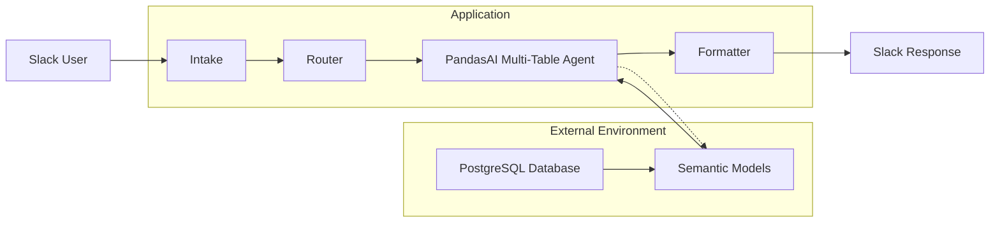

# Project Context

## 1. Project Overview

A Slackbot that lets users ask natural-language analytics questions about data in PostgreSQL. Users do not need SQL knowledge. The system interprets questions using semantic models that capture business descriptions, relationships, aliases, metadata, and derived metrics, together with a PandasAI multi-table agent, then returns answers in Slack.

## 2. System Scope

### In Scope

- Natural-language analytics questions via Slack
- PostgreSQL as the data source
- Semantic models representing PostgreSQL tables and business relationships (descriptions, metadata, relationships, aliases, derived metrics)
- PandasAI multi-table agent for dataset selection and analytics reasoning
- Structured response formatting and delivery back to Slack

### Explicitly Out Of Scope

- Custom business intelligence dashboards
- Manual SQL querying by end users
- Data modification or write-back operations

## 3. Architecture Summary

The application processes analytics requests through Intake, Router, PandasAI Multi-Table Agent, and Formatter components. It interacts with external resources including PostgreSQL and semantic models that provide business context for analytics reasoning.

### Request Flow

1. **Intake** — Receives the user's question from Slack.
2. **Router** — Directs the request into the analytics pipeline.
3. **PandasAI Multi-Table Agent** — Selects relevant datasets and performs analytics reasoning.
4. **Formatter** — Shapes the agent output for Slack.
5. **Slack Response** — Delivers the answer to the user.

### Data Flow

- **PostgreSQL Database** holds the underlying tables.
- **Semantic Models** enrich those tables with business context (descriptions, metadata, relationships, aliases, derived metrics).
- The enriched models are used by the **PandasAI Multi-Table Agent** during analytics reasoning and dataset selection.

## 4. Key Inputs and Outputs

| Direction | What | Description |
|-----------|------|-------------|
| **Input** | Slack message | Natural-language analytics question from a user |
| **Input** | PostgreSQL data | Tabular data queried at runtime |
| **Input** | Semantic models | Business-layer definitions that describe tables, relationships, aliases, and derived metrics |
| **Output** | Slack message | Formatted analytics answer derived from agent reasoning |

## 5. Design Rationale

- **Semantic models over raw schema** — Business descriptions, relationships, aliases, and derived metrics give the agent enough context to interpret questions without users writing SQL or knowing table names.
- **PandasAI multi-table agent as the core reasoner** — A single agent handles both dataset selection and analytics reasoning, reducing implementation complexity while supporting multi-table analysis.
- **Slack as the interface** — Meets users where they already work and provides a conversational experience for data exploration.
- **Linear pipeline** — Intake → Router → Agent → Formatter keeps responsibilities clear and the system easy to understand, maintain, and debug.
