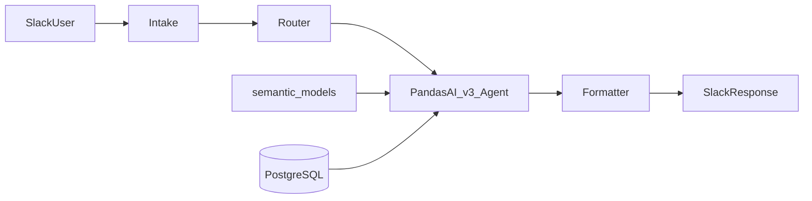

# Talk-to-Data Slackbot

> README V1 Draft (June 2026)
>
> This document reflects the current MVP state of the project and is expected to evolve as additional improvements are implemented.

Natural-language analytics in Slack over PostgreSQL. Mention the bot, ask a question in plain English, and get an answer—without writing SQL. The backend uses semantic models and a **PandasAI v3** multi-table agent; responses appear in the Slack thread as text, tables, or charts.

This README describes the project **as it exists today**. It will evolve over upcoming development sessions and does **not** imply production readiness or a finished public release.

- Product scope: [PROJECT_CONTEXT.md](PROJECT_CONTEXT.md)
- Implementation rules: [AGENTS.md](AGENTS.md)
- Semantic layer authoring: [semantic_models/README.md](semantic_models/README.md)

---

## 1. Project Overview

**Talk-to-Data Slackbot** connects Slack to PostgreSQL through a linear pipeline:

**Slack → Intake → Router → PandasAI v3 Multi-Table Agent → Formatter → Slack**

YAML files under `semantic_models/` describe four business datasets (`users`, `subscriptions`, `sessions`, `payments`), including relationships, aliases, and derived metrics. Runtime database access uses the `DATABASE_URL` environment variable.

**In scope:** read-only analytics via Slack, multi-table questions, formatted replies.

**Out of scope:** BI dashboards, end-user SQL tools, data write-back (see PROJECT_CONTEXT.md).

---

## 2. Current MVP Status

### Completed components


| #   | Component         | Location                                                                    |
| --- | ----------------- | --------------------------------------------------------------------------- |
| 1   | Foundation        | `config.py`, `postgres.py`                                                  |
| 2   | Semantic layer    | `semantic_models/`, `pandas_ai/semantic_loader.py`, `semantic_validator.py` |
| 3   | PandasAI v3 agent | `pandas_ai/analytics.py`, `pandas_ai/llm.py`                                |
| 4   | Formatter         | `formatter/slack.py`                                                        |
| 5   | Intake            | `intake/parser.py`, `dedupe.py`, `envelope.py`                              |
| 6   | Router            | `router/handler.py`                                                         |
| 7   | Slack runtime     | `intake/slack_app.py`, `main.py` (Socket Mode)                              |
| 8   | Documentation     | This README (draft)                                                         |


### Validated end-to-end

- **Unit tests:** `pytest tests/unit/ -v` → **75/75 passing**.
- **Slack workflow (manual):** Socket Mode bot responds to `@app_mention` with text, tabular, and chart outputs in a channel thread (see [Example Conversations](#12-example-conversations)).
- **Pipeline wiring:** Intake → Router → Agent → Formatter covered by unit tests with mocked boundaries where appropriate.

### Under active development

- README polish, screenshots in-repo, and publication checklist.
- Repository hygiene (secrets, `datasets/` cache, license, CI).
- Documentation and UX improvements planned for mid-week sessions (see [Planned Improvements](#15-planned-improvements)).

---

## 3. Meet the Slackbot


|                        |                                                                                              |
| ---------------------- | -------------------------------------------------------------------------------------------- |
| **Slack app name**     | **Analyst Agent by Sri Bandhakavi** (your workspace display name may vary)                   |
| **What it does**       | Answers analytics questions about PostgreSQL data in the channel thread where you mention it |
| **Who it is for**      | Teammates who want quick data answers in Slack without SQL or a separate BI tool             |
| **How you talk to it** | `@Analyst Agent by Sri Bandhakavi` + a natural-language question                             |


### Supported response types


| Type       | What you see in Slack                                           |
| ---------- | --------------------------------------------------------------- |
| **Text**   | Short numeric or sentence answers (e.g. a single count)         |
| **Tables** | Formatted rows/columns in the message (dataframe-style results) |
| **Charts** | A short message plus a **PNG chart** uploaded in the thread     |


Chart replies use the message: *"I've generated a chart for your question."* (see `formatter/slack.py`).

---

## 4. Using the Slackbot

1. **Invite the bot** to a Slack channel (e.g. a private `#test` channel used during development).
2. **Mention the bot** in a message: `@Analyst Agent by Sri Bandhakavi`
3. **Ask a natural-language question** in the same message (see [Example Slack Questions](#11-example-slack-questions)).
4. **Receive a response** in the thread—text, a table, or a chart image depending on the question and agent result.

The bot listens for `**app_mention`** events over **Socket Mode** (`python -m talk_to_data_slackbot.main`). Duplicate Slack event deliveries are ignored via in-memory deduplication on `event_id`.

---

## 5. Architecture Overview




| Stage           | Role                                                 |
| --------------- | ---------------------------------------------------- |
| **Intake**      | Parse `app_mention`, dedupe, build `RequestEnvelope` |
| **Router**      | `run_query` → `format_response`                      |
| **PandasAI v3** | Register datasets, `Agent.chat(question)`            |
| **Formatter**   | Slack text/blocks; chart file for upload             |


---

## 6. Current Features

- Slack `**app_mention`** handling (Socket Mode)
- Natural-language analytics over **four** semantic datasets
- **Multi-table** questions via declared relationships (users ↔ subscriptions ↔ payments, users ↔ sessions)
- **Text**, **table**, and **chart** Slack responses
- Chart upload via `files_upload_v2` when the agent returns a chart path
- Business **aliases** (e.g. region, platform, revenue) in semantic models
- **Derived metrics** in YAML (e.g. subscription length in days, session hours)
- **In-memory** duplicate-event suppression
- **User-facing errors** without stack traces in Slack

---

## 7. Repository Structure

```
talk-to-data-slackbot/
├── talk_to_data_slackbot/
│   ├── config.py, postgres.py
│   ├── intake/          # parser, dedupe, slack_app.py, main entry via main.py
│   ├── router/
│   ├── formatter/
│   └── pandas_ai/       # PandasAI v3 integration
├── semantic_models/     # users, subscriptions, sessions, payments
├── tests/unit/          # 75 tests
├── tests/integration/   # optional live PostgreSQL
├── .env.example
├── PROJECT_CONTEXT.md
├── AGENTS.md
└── pyproject.toml
```

**Local / gitignored:** `.env`, `.venv/`, `datasets/` (PandasAI cache), `exports/` (chart artifacts).

---

## 8. Setup Instructions

**Prerequisites**

- Python **3.10 or 3.11**
- PostgreSQL with tables matching `semantic_models/` (`public.users`, `subscriptions`, `sessions`, `payments`)
- OpenAI API key (LiteLLM / PandasAI)
- Slack app with **Socket Mode** and `**app_mention`** subscription

**Install**

```bash
git clone <repository-url>
cd talk-to-data-slackbot
python -m venv .venv
# Windows:  .venv\Scripts\activate
# macOS/Linux:  source .venv/bin/activate
pip install -e ".[dev]"
```

### Development workflow (virtual environment)

This is the workflow used during MVP development. It works on all platforms; on **Windows**, prefer calling the venv `python.exe` directly (see note below).

From the repository root:

**1. Create the virtual environment**

```bash
python -m venv .venv
```

**2. Install dependencies** (uses the venv interpreter, no activation required)

```bash
.venv\Scripts\python.exe -m pip install -e ".[dev]"
```

On macOS/Linux, use `.venv/bin/python -m pip install -e ".[dev]"` instead.

**3. Complete the Configure steps below**, then **start the Slackbot**:

```bash
.venv\Scripts\python.exe -m talk_to_data_slackbot.main
```

On macOS/Linux: `.venv/bin/python -m talk_to_data_slackbot.main`

When Socket Mode connects successfully, the console should show:

```text
Bolt app is running!
```

**Windows note:** Some Windows environments block PowerShell activation scripts (`Activate.ps1`) because of execution policy restrictions. For this project, the recommended approach is to use the virtual environment's Python executable directly (as above) rather than relying on `activate`.

**Configure**

1. Copy `.env.example` → `.env` and set variables ([Environment Variables](#9-environment-variables)).
2. Point `DATABASE_URL` at your PostgreSQL instance.
3. Create/configure the Slack app; add bot to a channel; enable Socket Mode and required scopes (e.g. `app_mentions:read`, `chat:write`, and file upload for charts).

Detailed Slack UI steps are workspace-specific—add a checklist screenshot when available.

---

## 9. Environment Variables


| Variable               | Required        | Purpose                                        |
| ---------------------- | --------------- | ---------------------------------------------- |
| `DATABASE_URL`         | Yes             | PostgreSQL for analytics and schema validation |
| `OPENAI_API_KEY`       | Yes (analytics) | LLM for PandasAI                               |
| `PANDASAI_MODEL`       | No              | Default `gpt-4o-mini`                          |
| `SLACK_BOT_TOKEN`      | Yes (runtime)   | Bot token (`xoxb-...`)                         |
| `SLACK_APP_TOKEN`      | Yes (runtime)   | Socket Mode app token (`xapp-...`)             |
| `SLACK_SIGNING_SECRET` | No              | For HTTP Events if added later                 |
| `LOG_LEVEL`            | No              | Default `INFO`                                 |


Never commit `.env`. Semantic YAML `connection` blocks use **placeholders** for loader validation; live connections use `DATABASE_URL` at registration time.

---

## 10. Running the Application

If you followed [Development workflow (virtual environment)](#development-workflow-virtual-environment) in §8, start the bot with:

```bash
.venv\Scripts\python.exe -m talk_to_data_slackbot.main
```

Alternatively, with the venv activated (macOS/Linux or Windows where activation works):

```bash
python -m talk_to_data_slackbot.main
```

Expect `**Bolt app is running!**` in the terminal when the Slack Socket Mode handler is up.

Then in Slack:

```text
@Analyst Agent by Sri Bandhakavi <your question here>
```

First run may register PandasAI datasets and create files under `datasets/` (regenerable local cache).

---

## 11. Example Slack Questions

Aligned with current semantic models; results depend on your data and the model.

**Subscriptions**

- How many active subscriptions are there?
- Subscription churn by plan

**Users / acquisition**

- Users by region
- Signups by platform

**Revenue (multi-table)**

- Which users generated the most revenue?
- Total revenue last month
- Revenue by subscription plan

**Charts**

- Create a bar chart of subscription counts by region
- Plot signups over time

**Sessions**

- Average session duration by activity type

---

## 12. Example Conversations

Observed in a development Slack workspace (`#test`, Socket Mode). Your numbers and labels will match your database.

### Text response

**User:**

```text
@Analyst Agent by Sri Bandhakavi how many active subscriptions are there?
```

**Bot:**

```text
18684
```


---

### Table response

**User:**

```text
@Analyst Agent by Sri Bandhakavi which users generated the most revenue?
```

**Bot:** (tabular reply in thread; excerpt)


| user_id | total_revenue |
| ------- | ------------- |
| 2601    | 450.0         |
| 6628    | 450.0         |
| 5884    | 450.0         |
| 14626   | 440.0         |
| …       | …             |


*(Full table in Slack showed 10 rows with a "Show less" control.)*


---

### Chart response

**User:**

```text
@Analyst Agent by Sri Bandhakavi create a bar chart of subscription counts by region
```

**Bot:**

```text
I've generated a chart for your question.
```

Plus an attached PNG (e.g. `temp_chart_….png`) titled **"Subscription Counts by Region"** with regions **US**, **EU**, **India**, **West** on the x-axis and subscription count on the y-axis (US highest in the observed run).


---

## 13. Testing

**Unit tests (default):**

```bash
pytest tests/unit/ -v
```

Expected: **75 passed**.

**Integration tests (optional, live PostgreSQL):**

```bash
pytest tests/integration/ -v
```

Requires `DATABASE_URL` and a schema consistent with `semantic_models/`.

---

## 14. Current Limitations

- **Socket Mode only** — no HTTP Events entrypoint in `main.py` today
- `**app_mention` only** — not slash commands or generic DMs unless extended
- **In-memory dedupe** — not durable across restarts
- **Read-only** — no mutations
- **LLM variability** — answers can be wrong, empty, or slow
- **Slack truncation** — very long text/tables are trimmed for block limits
- **Charts** — require agent chart output, local file path, and Slack file-upload permission
- **Schema coupling** — PostgreSQL must match semantic model tables/columns
- **Not hardened** for untrusted multi-tenant production without further security and ops work

---

## 15. Planned Improvements

*Future work only—not implemented in the current MVP.*

- Richer charting
- Downloadable outputs (e.g. CSV beyond inline chart PNG)
- Markdown or structured reports in Slack
- Enhanced reasoning / narrative report generation
- Slack UX improvements (e.g. clearer threading, slash commands, home tab—TBD)
- Documentation improvements (in-repo screenshots, setup checklist, CI badge)

Architecture remains **PandasAI v3 + linear pipeline** per AGENTS.md (no alternate agent frameworks).

---

## 16. Development Notes

- **PandasAI v3 only** — see AGENTS.md before changing agent code
- **New tables:** edit `semantic_models/` first, then agent wiring
- **Boundaries:** analytics in `pandas_ai/`; Slack I/O in `intake/` + `formatter/`; keep Router thin
- **Secrets:** env vars only; placeholder `connection` in semantic YAML
- **Cache:** delete `datasets/` or change `DATABASE_URL` to force dataset re-registration
- **Tech stack:** Python 3.10–3.11, `pandasai>=3,<4`, `pandasai-sql[postgres]`, `slack-bolt`, `pydantic-settings` — see `pyproject.toml`

---

## README Gap Analysis

### Missing information to add later

- Repository URL and clone path
- **LICENSE** file and copyright line
- Maintainer / contact / support channel
- Exact Slack app creation steps (OAuth scopes, event subscriptions) with redacted screenshots
- PostgreSQL provisioning (seed SQL, migrations, or course DB instructions)
- Pin **75/75** to a commit SHA or date when publishing
- CI workflow and badge (if added)
- Security disclosure process for a public repo
- Confirm git history and tracked files contain **no** production credentials post-cleanup
- In-repo paths for screenshots (e.g. `docs/images/…`) once files are copied from local assets

### Recommended screenshots


| Priority | Screenshot                                               | README section      |
| -------- | -------------------------------------------------------- | ------------------- |
| High     | Slack **text** response (active subscriptions → `18684`) | §12 + hero / §3     |
| High     | Slack **table** (top users by revenue)                   | §12                 |
| High     | Slack **chart** (subscription counts by region)          | §12 + §3            |
| Medium   | **Architecture** diagram (pipeline)                      | §5                  |
| Medium   | Slack app config (Socket Mode, `app_mention`, scopes)    | §8                  |
| Low      | Full channel + thread layout (context for new users)     | §4 or top of README |


Source captures exist locally (e.g. development `#test` thread, June 2026); add to repo before GitHub render.

### Sections to update before GitHub publication

- §2 — freeze validation claims with tag/date
- §3–§4 — align bot display name if renamed in Slack API
- §8 — complete Slack setup once screenshots exist
- §12 — replace `TODO` image paths with real `` links
- §9 — re-sync with `.env.example` after any config changes
- Add **License** and **Contributing** (pointer to AGENTS.md) footers
- Remove “draft” banner when README is declared stable

### Items to wait until Wednesday/Thursday improvements

- Richer charting and visualization options
- Downloadable outputs
- Markdown / enhanced report generation in Slack
- Broader Slack UX (slash commands, interactive elements—only if implemented)
- Polished documentation pack (all screenshots, setup video, CI)
- Any narrative “report generation” beyond current text/table/chart paths
- Production deployment / hosting guide (not in MVP scope today)

Until those land, keep §15 as the single “future work” list and avoid documenting unbuilt behavior in §6 or §12.