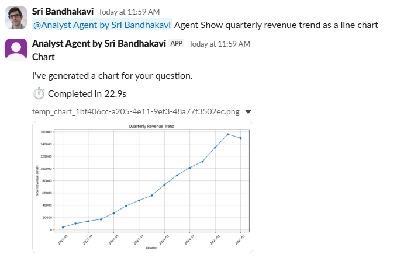
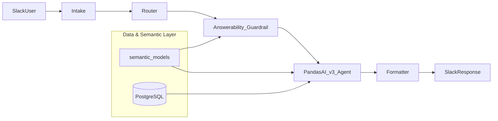
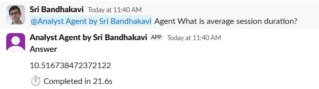
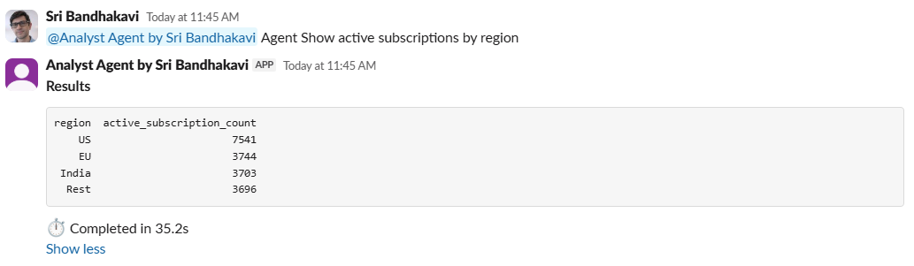
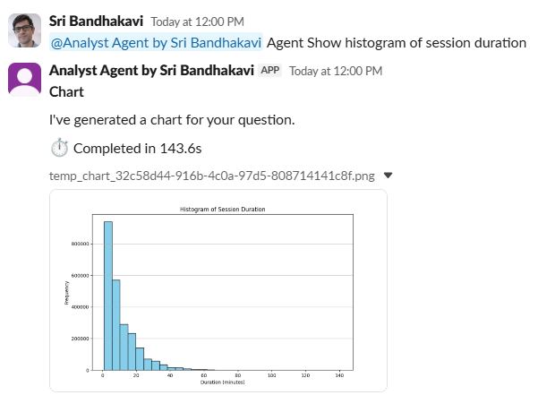
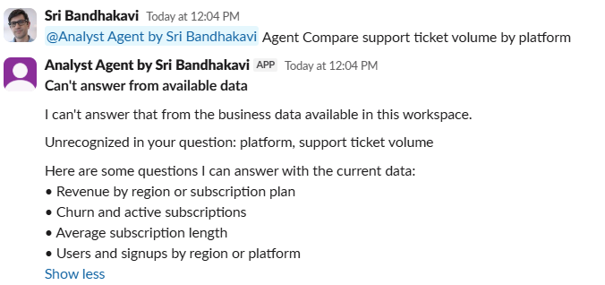

# Talk-to-Data Slackbot

Natural-language analytics in Slack over PostgreSQL. Mention the bot, ask a question in plain English, and get an answer—without writing SQL. Semantic models describe the business layer; a **PandasAI v3** multi-table agent runs the analytics; responses appear in the thread as text, tables, or charts.

Originally developed during an AI Workflows course taught by Andres Vourakis. 

- Product scope: [PROJECT_CONTEXT.md](PROJECT_CONTEXT.md)
- Implementation rules: [AGENTS.md](AGENTS.md)
- Semantic layer authoring: [semantic_models/README.md](semantic_models/README.md)



---

## 1. Project Overview

**Talk-to-Data Slackbot** is a practical analytics assistant that connects Slack to PostgreSQL through a linear pipeline:

**Slack → Intake → Router → Answerability Guardrail → PandasAI v3 Agent → Formatter → Slack**

A **Data & Semantic Layer**—PostgreSQL plus YAML semantic models (`users`, `subscriptions`, `sessions`, `payments`)—underpins the answerability guardrail and the PandasAI agent. Analytics queries use `DATABASE_URL` at runtime.

The included semantic models are based on a reference PostgreSQL analytics dataset used for development, testing, and demonstration. The architecture is designed to support alternative schemas by creating corresponding semantic model definitions.

**In scope:** read-only analytics via Slack, multi-table questions, formatted replies, guardrails for unsupported questions.

**Out of scope:** BI dashboards, end-user SQL tools, data write-back (see [PROJECT_CONTEXT.md](PROJECT_CONTEXT.md)).

---

## 2. Current Status

### Components


| #   | Component               | Location                                                                          |
| --- | ----------------------- | --------------------------------------------------------------------------------- |
| 1   | Foundation              | `config.py`, `postgres.py`                                                        |
| 2   | Semantic layer          | `semantic_models/`, `pandas_ai/semantic_loader.py`, `semantic_validator.py`       |
| 3   | Answerability guardrail | `pandas_ai/answerability.py`, `answerability_classifier.py`, `concept_lexicon.py` |
| 4   | PandasAI v3 agent       | `pandas_ai/analytics.py`, `pandas_ai/llm.py`                                      |
| 5   | Formatter               | `formatter/slack.py`                                                              |
| 6   | Intake                  | `intake/parser.py`, `dedupe.py`, `envelope.py`, `slack_app.py`                    |
| 7   | Router                  | `router/handler.py`                                                               |
| 8   | Slack runtime           | `main.py` (Socket Mode)                                                           |


### Validation summary

Validated capabilities include:

- Slack integration (Socket Mode, `app_mention`)
- Semantic layer (users, subscriptions, sessions, payments)
- PostgreSQL analytics
- PandasAI v3 multi-table agent
- Revenue analysis and multi-table revenue joins
- Subscription analytics (e.g. active subscriptions)
- User acquisition analysis
- Multi-table reporting
- Chart generation (bar charts, line charts, histograms)
- Guardrail rejection of unsupported questions

**Automated tests:** Automated validation includes 145 unit tests plus manual Slack end-to-end testing. Some behavior depends on optional answerability settings in `.env` (see [Environment Variables](#9-environment-variables)).

**Manual Slack workflow:** text, table, and chart replies in channel threads ([Example Conversations](#12-example-conversations)).

The project is under active improvement (semantic models, classifier behavior, documentation screenshots).

---

## 3. Meet the Slackbot


|                        |                                                                                              |
| ---------------------- | -------------------------------------------------------------------------------------------- |
| **Slack app name**     | **Analyst Agent by Sri Bandhakavi** (workspace display name may vary)                        |
| **What it does**       | Answers analytics questions about PostgreSQL data in the channel thread where you mention it |
| **Who it is for**      | Teammates who want quick data answers in Slack without SQL or a separate BI tool             |
| **How you talk to it** | `@Analyst Agent by Sri Bandhakavi` + a natural-language question                             |


### Supported response types


| Type       | What you see in Slack                                           |
| ---------- | --------------------------------------------------------------- |
| **Text**   | Short numeric or sentence answers (e.g. a single count)         |
| **Tables** | Formatted rows/columns in the message (dataframe-style results) |
| **Charts** | A short message plus a **PNG chart** uploaded in the thread     |


Chart replies use the message: *"I've generated a chart for your question."* (see `formatter/slack.py`).

---

## 4. Using the Slackbot

1. **Invite the bot** to a Slack channel.
2. **Mention the bot** in a message: `@Analyst Agent by Sri Bandhakavi`
3. **Ask a natural-language question** in the same message (see [Example Slack Questions](#11-example-slack-questions)).
4. **Receive a response** in the thread—text, a table, or a chart depending on the question and agent result.

The bot listens for `app_mention` events over **Socket Mode** (`python -m talk_to_data_slackbot.main`). Duplicate Slack deliveries are suppressed via in-memory deduplication on `event_id`.

---

## 5. Architecture Overview

The request path runs left to right through the application. **Data & Semantic Layer** (below) is the shared foundation: semantic model metadata for answerability and agent configuration, and PostgreSQL for query execution.




| Stage                       | Role                                                                                                   |
| --------------------------- | ------------------------------------------------------------------------------------------------------ |
| **Intake**                  | Parse `app_mention`, dedupe, build `RequestEnvelope`                                                   |
| **Router**                  | Run answerability assessment; on success invoke analytics and return a formatted Slack reply           |
| **Answerability guardrail** | Load `semantic_models/` metadata into a catalog; accept or reject the question before the agent runs   |
| **PandasAI v3**             | Register datasets from the same semantic models; `Agent.chat(question)` queries PostgreSQL             |
| **Formatter**               | Slack text/blocks; chart file upload when applicable                                                   |
| **Data & Semantic Layer**   | `semantic_models/` business metadata (guardrail + agent); PostgreSQL tabular data (agent queries only) |


### Answerability guardrail

Before any analytics run, the router calls a **semantic-model-aware answerability** layer. It reads `semantic_models/` from the Data & Semantic Layer—the same YAML used to register PandasAI datasets:

- Builds a classifier or lexicon catalog from descriptions, aliases, relationships, and derived fields.
- Optionally uses an **LLM classifier** when `USE_LLM_ANSWERABILITY=true` (see `.env.example`).
- Falls back to a **deterministic lexicon guardrail** when the classifier is off or when `ANSWERABILITY_FALLBACK_ON_ERROR=true` and the LLM call fails.
- **Unsupported questions are rejected** with a clear Slack message; the PandasAI agent is not invoked.

This keeps analytics focused on documented business data and avoids silent guesses on out-of-scope topics.

---

## 6. Current Features

- Slack `app_mention` handling (Socket Mode)
- Answerability guardrail (optional LLM + deterministic fallback)
- Natural-language analytics over **four** semantic datasets
- **Multi-table** questions via declared relationships (users ↔ subscriptions ↔ payments, users ↔ sessions)
- **Text**, **table**, and **chart** Slack responses
- Chart upload via `files_upload_v2` when the agent returns a chart path
- Business **aliases** (e.g. region, platform, revenue) in semantic models
- **Derived metrics** in YAML (e.g. subscription length in days, session hours)
- In-memory duplicate-event suppression
- User-facing errors and guardrail messages without stack traces in Slack

---

## 7. Repository Structure

```
talk-to-data-slackbot/
├── talk_to_data_slackbot/
│   ├── config.py, postgres.py
│   ├── intake/              # parser, dedupe, slack_app.py
│   ├── router/
│   ├── formatter/
│   └── pandas_ai/           # PandasAI v3 + answerability
│       ├── analytics.py, llm.py
│       ├── answerability.py
│       ├── answerability_classifier.py
│       └── concept_lexicon.py
├── semantic_models/         # users, subscriptions, sessions, payments
├── tests/unit/              # 145 tests
├── tests/integration/       # optional live PostgreSQL
├── .env.example
├── PROJECT_CONTEXT.md
├── AGENTS.md
└── pyproject.toml
```

**Local / gitignored:** `.env`, `.venv/`, `datasets/` (PandasAI cache), `exports/` (chart artifacts).

---

## 8. Setup Instructions

**Prerequisites**

- Python **3.10 or 3.11**
- PostgreSQL with tables matching `semantic_models/` (`public.users`, `subscriptions`, `sessions`, `payments`)
- OpenAI API key (LiteLLM / PandasAI)
- Slack app with **Socket Mode** and `app_mention` subscription

**Install**

```bash
git clone <repository-url>
cd talk-to-data-slackbot
python -m venv .venv
pip install -e ".[dev]"
```

### Development workflow (virtual environment)

On **Windows**, prefer the venv interpreter directly:

```bash
.venv\Scripts\python.exe -m pip install -e ".[dev]"
.venv\Scripts\python.exe -m talk_to_data_slackbot.main
```

On macOS/Linux: `.venv/bin/python` instead of `.venv\Scripts\python.exe`.

When Socket Mode connects, expect:

```text
Bolt app is running!
```

**Configure**

1. Copy `.env.example` → `.env` and set variables ([Environment Variables](#9-environment-variables)).
2. Point `DATABASE_URL` at your PostgreSQL instance.
3. Configure the Slack app (Socket Mode, `app_mentions:read`, `chat:write`, file upload for charts) and invite the bot to a channel.

---

## 9. Environment Variables


| Variable                          | Required        | Purpose                                                                    |
| --------------------------------- | --------------- | -------------------------------------------------------------------------- |
| `DATABASE_URL`                    | Yes             | PostgreSQL for analytics and schema validation                             |
| `LOG_LEVEL`                       | No              | Logging verbosity (default `INFO`)                                         |
| `OPENAI_API_KEY`                  | Yes (analytics) | LLM for PandasAI                                                           |
| `PANDASAI_MODEL`                  | No              | Default `gpt-4o-mini`                                                      |
| `USE_LLM_ANSWERABILITY`           | No              | Enable LLM answerability classifier (default `false`)                      |
| `ANSWERABILITY_MODEL`             | No              | Model for classifier; defaults to `PANDASAI_MODEL` when unset              |
| `ANSWERABILITY_TIMEOUT_SECONDS`   | No              | Classifier timeout (default `10`)                                          |
| `ANSWERABILITY_FALLBACK_ON_ERROR` | No              | Fall back to deterministic guardrail on classifier errors (default `true`) |
| `SLACK_BOT_TOKEN`                 | Yes (runtime)   | Bot token (`xoxb-...`)                                                     |
| `SLACK_APP_TOKEN`                 | Yes (runtime)   | Socket Mode app token (`xapp-...`)                                         |
| `SLACK_SIGNING_SECRET`            | No              | For HTTP Events API if added later                                         |


Never commit `.env`. Semantic YAML `connection` blocks use placeholders for validation; live registration uses `DATABASE_URL`.

---

## 10. Running the Application

```bash
.venv\Scripts\python.exe -m talk_to_data_slackbot.main
```

Then in Slack:

```text
@Analyst Agent by Sri Bandhakavi <your question here>
```

First run may register PandasAI datasets and create files under `datasets/` (regenerable local cache).

---

## 11. Example Slack Questions

Examples aligned with validated end-to-end Slack testing. Results depend on your data and configured semantic models.

### Single-Table Analytics (users, subscriptions, sessions)

- How many users do we have?
- How many active subscriptions are there?
- Show active subscriptions by region
- Show user acquisition by platform
- Show users by platform
- What is average session duration?
- Show average session duration by activity type

### Multi-Table Analytics (users + subscriptions + payments)

- Show revenue by region
- Show revenue by subscription plan
- What is total revenue?
- Show revenue by region as a table

### Charts & Visualizations (users, subscriptions, payments, sessions)

- Show revenue by region as a bar chart
- Show quarterly revenue trend as a line chart
- Show histogram of session duration

### Question Phrasing Tips

The answerability layer performs best with direct analytical questions that closely match documented business concepts in the semantic models. Some executive-style or highly interpretive questions may require more explicit phrasing.


| Instead of                               | Try                               |
| ---------------------------------------- | --------------------------------- |
| Which region generates the most revenue? | Show revenue by region            |
| Where are most users located?            | Show users by region              |
| Which subscription plan performs best?   | Show revenue by subscription plan |
| Which platform acquires the most users?  | Show user acquisition by platform |


The alternative phrasings above provide the same underlying information while aligning more closely with the semantic concepts currently available to the answerability layer.

---

## 12. Example Conversations

Observed in a development Slack workspace. Results will vary depending on your data and semantic models.

### Text Response



---

### Table Response



---

### Chart Response



---

### Answerability Guardrail

Unsupported questions are intercepted before reaching the analytics agent.



---

## 13. Testing

**Unit tests:**

```bash
pytest tests/unit/ -v
```

**Integration tests (optional, live PostgreSQL):**

```bash
pytest tests/integration/ -v
```

Requires `DATABASE_URL` and a schema consistent with `semantic_models/`.

---

## 14. Limitations

The platform supports a broad range of analytics, aggregation, reporting, and visualization use cases through a semantic-model-driven interface backed by a PostgreSQL database. Current strengths include revenue analysis, subscription analytics, user acquisition trends, multi-table reporting, and chart generation directly within Slack using semantic models built on users, subscriptions, sessions, and payments data.

Natural-language support continues to evolve, particularly for some executive-style and lifecycle analytics questions.

**Technical MVP notes**

- Socket Mode and `app_mention` only (no slash commands or DMs unless extended)
- In-memory dedupe (not durable across restarts)
- Read-only analytics
- LLM variability in answers and classifier decisions
- Slack message size limits may truncate long tables
- Charts require agent output, a local chart path, and Slack file-upload permission
- PostgreSQL schema must match semantic model definitions
- Not hardened for untrusted multi-tenant production without further security and operations work

---

## 15. Planned Improvements

- Improved alignment between semantic models and answerability behavior
- Improved support for executive-style business questions
- Optional richer exports and Slack UX enhancements
- In-repo documentation screenshots

Architecture remains **PandasAI v3** and the linear pipeline described in [AGENTS.md](AGENTS.md).

---

## 16. Development Notes

- **PandasAI v3 only** — see [AGENTS.md](AGENTS.md) before changing agent code
- **New tables:** edit `semantic_models/` first, then agent wiring
- **Boundaries:** analytics and answerability in `pandas_ai/`; Slack I/O in `intake/` + `formatter/`; keep Router thin
- **Secrets:** environment variables only; placeholder `connection` in semantic YAML
- **Cache:** delete `datasets/` or change `DATABASE_URL` to force dataset re-registration
- **Tech stack:** Python 3.10–3.11, `pandasai>=3,<4`, `pandasai-sql[postgres]`, `slack-bolt`, `pydantic-settings` — see `pyproject.toml`